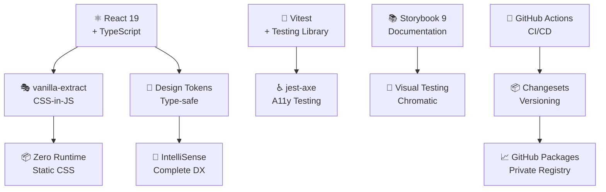
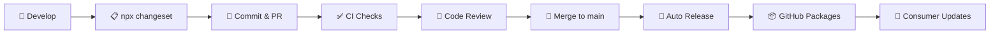

# 🦁 CodeLion DS

> **Design System profesional** construido con React, TypeScript y vanilla-extract.  
> Componentes robustos, accesibles y type-safe para aplicaciones modernas.

---

## ✨ Características Principales

| Feature | Descripción | Beneficio |
|---------|-------------|-----------|
| 🎭 **vanilla-extract** | CSS-in-JS con zero runtime | Bundle 80% menor vs styled-components |
| 🔧 **TypeScript First** | Type-safety completo | IntelliSense para tokens y props |
| ♿ **WCAG 2.1 AA** | Accesibilidad integrada | Tests automáticos con axe-core |
| 📦 **Tree Shakeable** | Importa solo lo necesario | Optimización automática de bundle |
| 🚀 **CI/CD Completo** | GitHub Actions + Changesets | Release automático con changelog |
| 📚 **Storybook 9** | Documentación interactiva | Playground y guías de uso |

## 🚀 Quick Start

### 1. Configuración

```bash
# Configurar registry
echo "@codelion:registry=https://npm.pkg.github.com" >> .npmrc
echo "//npm.pkg.github.com/:_authToken=\${NPM_TOKEN}" >> .npmrc

# Instalar CodeLion DS
npm install @johnatandeleon/design-system@^1.0.0
```

### 2. Setup en aplicación

```tsx
// main.tsx o _app.tsx
import '@johnatandeleon/design-system/styles';

// Tu componente
import { Button } from '@johnatandeleon/design-system';

function MyApp() {
  return (
    <Card>
      <Input placeholder="Escribe algo..." />
      <Button variant="primary" size="md" loading={false}>
        ¡Enviar!
      </Button>
    </Card>
  );
}
```

### 3. Usando tokens

```tsx
import { colors, spacing, typography } from '@johnatandeleon/design-system/styles';

const CustomComponent = {
  color: colors.primary[600],
  padding: spacing[4],
  fontSize: typography.fontSize.lg,
  background: `linear-gradient(${colors.primary[500]}, ${colors.primary[600]})`,
};
```

## 📊 Stack Tecnológico



## 🏗️ Estructura del Proyecto

```
src/
├── components/           # Componentes React
│   └── Button/
│       ├── Button.tsx           # Implementación
│       ├── Button.stories.tsx   # Documentación Storybook  
│       ├── Button.test.tsx      # Tests + A11y
│       └── index.ts             # Exports
├── styles/
│   ├── tokens/          # Design tokens (vanilla-extract)
│   │   ├── colors.css.ts       # Paleta completa
│   │   ├── spacing.css.ts      # Sistema de espaciado  
│   │   ├── typography.css.ts   # Escalas tipográficas
│   │   └── effects.css.ts      # Sombras, bordes, etc.
│   ├── recipes/         # Recetas de componentes
│   │   └── button.css.ts       # Variantes del botón
│   └── globals/         # CSS global y reset
├── utils/               # Utilidades compartidas
│   ├── cn.ts                   # Class name utilities
│   ├── a11y.ts                 # Helpers de accesibilidad
│   └── responsive.ts           # Utilities responsive
└── types/               # Tipos TypeScript globales
```

## 📋 Documentación

| Guía | Descripción | Audiencia |
|------|-------------|-----------|
| 📖 [**Getting Started**](./docs/getting-started.md) | Instalación y configuración básica | Todos |
| 🏷️ [**Versioning Guide**](./docs/versioning-guide.md) | Semantic versioning y changesets | Maintainers |
| 📦 [**Publishing Guide**](./docs/publishing-guide.md) | GitHub Packages y CI/CD | DevOps |
| 📥 [**Consumption Guide**](./docs/consumption-guide.md) | Uso en proyectos consumidores | Frontend Teams |
| 🔒 [**Best Practices**](./docs/best-practices.md) | Seguridad y compliance | Tech Leads |
| ⚡ [**Quick Reference**](./docs/quick-reference.md) | Comandos y cheatsheet | Todos |

## 🛠️ Comandos de Desarrollo

```bash
# 🚀 Desarrollo
npm run dev                 # Storybook en http://localhost:6006
npm run build              # Build librería para producción
npm run build-storybook    # Build documentación estática

# 🧪 Testing  
npm test                   # Tests unitarios + A11y
npm run test:coverage     # Con reporte de coverage
npm run test:ui           # Tests con interfaz visual

# 🔍 Quality Assurance
npm run lint              # ESLint + reglas accesibilidad  
npm run type-check        # Verificación TypeScript
npm run lint:fix          # Auto-fix de issues

# 🏷️ Versionado (Changesets)
npx changeset             # Crear changeset para release
npx changeset version     # Generar bump de versión
npx changeset publish     # Publicar a GitHub Packages
```

## 🔄 Workflow de Desarrollo



## 📈 Métricas y Monitoreo

- **Bundle Size**: `~15KB` (gzipped) para componentes base
- **Tree Shaking**: ✅ Solo importa componentes usados  
- **Performance**: Zero runtime CSS-in-JS
- **Accessibility**: 100% WCAG 2.1 AA compliance
- **TypeScript**: Strict mode con 0 `any` types
- **Test Coverage**: >95% con Visual + A11y testing

## 🤝 Contribución

### Para Maintainers del Design System

1. **Fork** y clona el repositorio
2. **Instala** dependencias: `npm install`
3. **Desarrolla** con Storybook: `npm run dev`
4. **Crea changeset**: `npx changeset`
5. **Tests** pasando: `npm test`
6. **PR** con review de 2+ maintainers

### Para Consumer Teams

1. **Issues** para reportar bugs o requests
2. **Discussions** para preguntas arquitecturales  
3. **Slack** `#design-system` para soporte rápido

## 🏷️ Versionado

Seguimos [**Semantic Versioning**](https://semver.org/) con [**Conventional Commits**](https://conventionalcommits.org/):

- `feat(component):` → **MINOR** version (1.1.0 → 1.2.0)
- `fix(component):` → **PATCH** version (1.1.0 → 1.1.1)  
- `feat(component)!:` → **MAJOR** version (1.1.0 → 2.0.0)

## 🎯 Roadmap

- ✅ **Q1 2025**: Componentes base (Button, Input, Card)
- 🚧 **Q2 2025**: Componentes de formulario y navegación
- 📋 **Q3 2025**: Componentes de visualización de datos
- 🔮 **Q4 2025**: Temas y customización avanzada

## 🙏 Reconocimientos

Construido con las mejores herramientas del ecosistema:

- 🎭 [**vanilla-extract**](https://vanilla-extract.style/) - CSS-in-JS type-safe
- 🧪 [**Vitest**](https://vitest.dev/) + [**Testing Library**](https://testing-library.com/) - Testing moderno  
- 📚 [**Storybook**](https://storybook.js.org/) - Documentación interactiva
- ♿ [**axe-core**](https://github.com/dequelabs/axe-core) - Accesibilidad automática
- 🏷️ [**Changesets**](https://github.com/changesets/changesets) - Release management

---

<div align="center">

**Made with 🦁 by CodeLion Team**  
*Design System that roars with power and elegance*

</div>