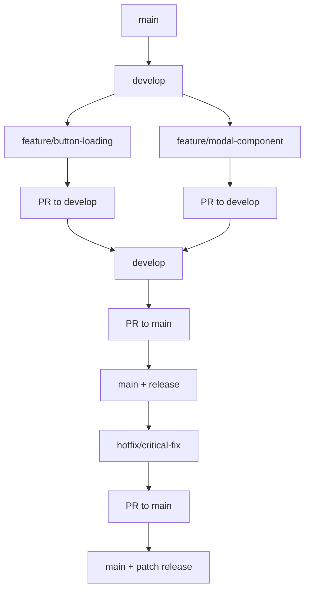

# 🔒 Buenas Prácticas y Seguridad

## 1. Gestión de Access Tokens

### 1.1 Tipos de tokens

```bash
# Personal Access Token (desarrollo)
# - Permisos: read:packages, write:packages
# - Scope: repo específico
# - Expiración: 90 días máximo

# GitHub Actions Token (CI/CD) 
# - Automático: ${{ secrets.GITHUB_TOKEN }}
# - Permisos: definidos en workflow
# - Sin expiración manual
```

### 1.2 Rotación de tokens

```bash
# Script de rotación (ejecutar cada 60 días)
#!/bin/bash

# 1. Generar nuevo token en GitHub
# 2. Actualizar en todos los entornos
kubectl patch secret npm-token \
  -p '{"data":{"token":"'$(echo -n $NEW_TOKEN | base64)'"}}' \
  -n production

# 3. Verificar funcionamiento
npm whoami --registry=https://npm.pkg.github.com

# 4. Revocar token anterior
```

### 1.3 Almacenamiento seguro

```yaml
# GitHub Secrets (por organización)
Organization Settings → Secrets and variables → Actions
- NPM_TOKEN: ghp_xxxxx (write:packages)
- CHROMATIC_TOKEN: xxxx (visual testing)

# Environment-specific secrets
Environment: production
- NPM_TOKEN_PROD: ghp_xxxxx (read-only)

Environment: staging  
- NPM_TOKEN_STAGING: ghp_xxxxx (read-only)
```

## 2. Permisos por Equipo

### 2.1 Estructura de permisos

```bash
# Design System Team (maintainers)
- write:packages (publicar)
- admin:repo (configuración)
- maintain:repo (branches protegidas)

# Frontend Teams (consumers)
- read:packages (descargar)
- triage:repo (issues)

# QA Team
- read:packages (testing)
- write:issues (reportar bugs)
```

### 2.2 Branch protection rules

```yaml
# main branch
required_status_checks:
  - test
  - build
  - changeset-check
enforce_admins: true
required_pull_request_reviews:
  required_approving_review_count: 2
  require_code_owner_reviews: true
restrictions:
  teams: ["design-system-maintainers"]
```

## 3. Estrategias de Branching

### 3.1 GitFlow Simplificado



### 3.2 Convenciones de branches

```bash
# Features
feature/component-name
feature/token-system-v2
feature/accessibility-improvements

# Bug fixes
fix/button-loading-state
fix/tooltip-positioning

# Hotfixes (críticos en producción)
hotfix/security-vulnerability
hotfix/breaking-change-revert  

# Releases
release/v2.0.0
release/v1.5.0
```

### 3.3 Etiquetado de releases

```bash
# Semantic versioning tags
git tag -a v1.2.3 -m "Release v1.2.3: Add Modal component"

# Tags con metadata
git tag -a v1.2.3 -m "
Release v1.2.3

New Features:
- Modal component with accessibility support
- Dark mode tokens

Bug Fixes:  
- Button loading state animation
- Tooltip positioning on mobile

Breaking Changes:
- None
"

# Push tags
git push origin --tags
```

## 4. Firmado de Paquetes

### 4.1 Configuración de firma

```bash
# Generar clave GPG
gpg --gen-key

# Configurar Git
git config --global user.signingkey YOUR_KEY_ID
git config --global commit.gpgsign true
git config --global tag.gpgsign true

# Configurar npm
npm config set sign-git-tag true
npm config set sign-git-commit true
```

### 4.2 Verificación de integridad

```bash
# Verificar firma del paquete
npm audit signatures

# Verificar checksums
npm pack --dry-run
shasum -a 256 package-name-1.0.0.tgz
```

## 5. Monitoreo y Alertas

### 5.1 Métricas clave

```yaml
# Dependabot alerts
security_advisories: enabled
auto_merge: 
  - dependency_type: "development"
    update_type: "semver:patch"

# Bundle size monitoring  
bundlesize:
  - path: "./dist/index.js"
    maxSize: "50 kB"
  - path: "./dist/styles.css" 
    maxSize: "10 kB"
```

### 5.2 Alertas automáticas

```yaml
# Slack notifications
- name: Notify Slack on Release
  uses: 8398a7/action-slack@v3
  with:
    status: ${{ job.status }}
    channel: '#design-system'
    text: |
      🎉 New design system release: ${{ github.ref }}
      📦 Package: @johnatandeleon/design-system@${{ steps.version.outputs.version }}
      📋 Changelog: ${{ github.server_url }}/${{ github.repository }}/releases/tag/${{ github.ref }}
```

## 6. Backup y Disaster Recovery

### 6.1 Backup de packages

```bash
# Script de backup
#!/bin/bash
VERSIONS=$(npm view @johnatandeleon/design-system versions --json)
mkdir -p backups/packages

for version in $(echo $VERSIONS | jq -r '.[]'); do
  npm pack @johnatandeleon/design-system@$version
  mv *.tgz backups/packages/
done
```

### 6.2 Mirror registry (opcional)

```bash
# Configurar registry alternativo
npm config set @company:registry https://npm.pkg.github.com
npm config set @company:registry https://your-backup-registry.com --fallback
```

## 7. Compliance y Auditoría

### 7.1 License scanning

```yaml
# Dependencias permitidas
allowed_licenses:
  - MIT
  - Apache-2.0
  - BSD-3-Clause
  - ISC

# Forbidden licenses
forbidden_licenses:
  - GPL-3.0
  - AGPL-3.0
```

### 7.2 Security scanning

```bash
# npm audit automático
npm audit --audit-level moderate

# Snyk integration
npx snyk test
npx snyk monitor
```